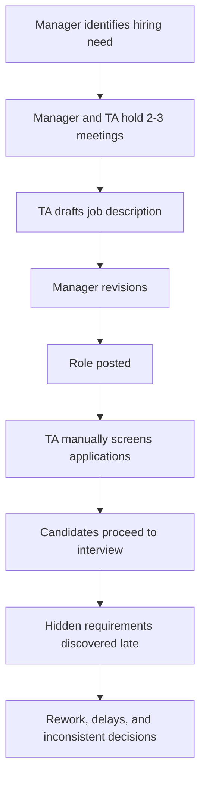
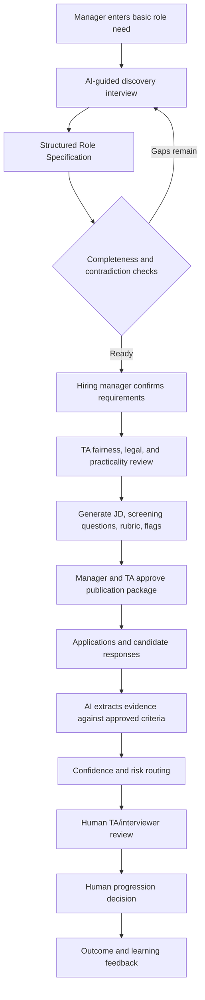
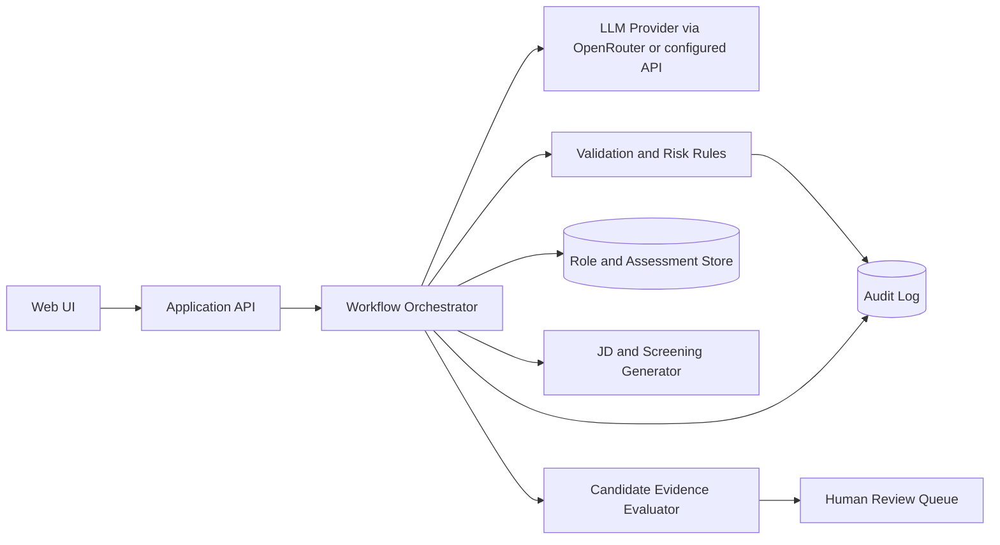

# ZURU AI Integration Internship Task — Codex Context Pack

## 0. Purpose of this file

This file consolidates:

1. Every substantive requirement in the supplied 13-page internship task PDF.
2. A deeper interpretation of the business problem and expected solution.
3. Current public context about ZURU, its business divisions, culture, internship programme, recruitment process, and ZURU DNA.
4. Current public context about ZURU's AI Integration function.
5. A practical system blueprint that Codex can use when helping design, implement, test, document, and present the prototype.

This is intended to be a **single context file for a coding agent**. It separates:

- **[REQUIRED]**: explicitly requested by the task PDF.
- **[CONTEXT]**: externally researched company information.
- **[RECOMMENDED]**: a design choice that would strengthen the solution but is not mandatory.
- **[OPTIONAL]**: a bonus or stretch capability.
- **[ASSUMPTION]**: a working assumption that should be validated.

Do not treat every recommendation in this file as a mandatory implementation requirement. The core goal is a coherent, practical, demonstrable prototype rather than an oversized production platform.

---

# 1. Executive summary

## 1.1 What ZURU is asking for

[REQUIRED] Build an **AI-augmented hiring system** that improves three connected stages:

1. **Hiring requirement discovery**
   - Extract comprehensive and prioritised requirements from hiring managers.
   - Handle vague, excessive, contradictory, or overly subjective input.

2. **Job-description and screening design**
   - Generate a professional ZURU-style job description.
   - Generate role-specific screening questions, evaluation criteria, red flags, green flags, and ZURU DNA integration points.

3. **Candidate evaluation assistance**
   - Evaluate candidate responses against the previously extracted requirements.
   - Show evidence, scores, confidence, uncertainty, and areas requiring human review.
   - Preserve human judgment rather than making final hiring decisions.

The system should form a traceable chain:

```text
Hiring-manager statement
    -> clarified requirement
    -> structured role specification
    -> job description and screening rubric
    -> candidate evidence
    -> AI-assisted assessment
    -> human decision
```

## 1.2 The key insight

The task is **not primarily a job-description generator**. The main business problem is poor information quality at the start of recruitment.

Weak role discovery causes:

```text
Ambiguous requirements
    -> weak or inaccurate JD
    -> weak screening criteria
    -> inconsistent screening
    -> unsuitable candidates reaching interviews
    -> wasted manager and TA time
```

The most valuable component is therefore the **structured requirement-discovery process**. Everything downstream should derive from one approved role specification.

## 1.3 Recommended product framing

[RECOMMENDED] Frame the prototype as a small **Hiring Intelligence Workspace** with three modules:

1. `Role Discovery Copilot`
2. `JD and Screening Pack Generator`
3. `Candidate Evaluation Assistant`

All modules should use one shared `RoleSpecification` object as the source of truth.

---

# 2. Source hierarchy and version note

## 2.1 Source hierarchy

Use sources in this order when requirements conflict:

1. Supplied internship task PDF.
2. Any ZURU DNA/culture one-pager or example job descriptions supplied directly by ZURU.
3. Current official ZURU website pages.
4. Current ZURU job advertisements and official recruitment materials.
5. Design assumptions in this file.

## 2.2 Version note

The supplied task document is titled **"ZURU AI Integration Internship Task 2025"**. Current public recruitment material refers to the **2026/2027 AI Integration Summer Internship**. Treat the PDF as the authoritative task specification unless ZURU provides an updated version.

---

# 3. Complete task brief from the PDF

## 3.1 Mission — PDF page 2

[REQUIRED] The system should:

- Build an AI-augmented system for hiring excellence, including prompting, information tracking, and workflow support.
- Extract comprehensive requirements from hiring managers.
- Enable consistent and fair candidate evaluation.
- Maintain human judgment in the hiring process.

## 3.2 Current state and pain points — PDF page 3

[REQUIRED CONTEXT] ZURU describes the current problems as:

- Hiring managers take **2–3 meetings**, totalling roughly **1–2 hours**, to articulate role requirements.
- **40% of job descriptions** require major revisions after posting.
- The Talent Acquisition team spends approximately **5 minutes per application** on initial screening.
- **25% of candidates** who pass initial screening fail basic role requirements during first interviews.
- Evaluation against ZURU DNA values is inconsistent across screeners.
- Critical distinctions between **must-haves** and **nice-to-haves** often emerge late.

## 3.3 Part 1: Discovery and system design — PDF page 4

[REQUIRED DELIVERABLE] Produce a system architecture document containing:

### A. Information extraction framework

- List **8–10 key questions** the AI system would ask hiring managers.
- Show how vague responses are handled.
  - Example: `"I need someone good with people."`
- Show how both technical skills and cultural-fit requirements are captured.

### B. Risk assessment matrix

- Identify **five potential biases** in automated screening.
- Give a mitigation strategy for each risk.
- Recommend human checkpoints.

### C. Process-flow diagram

Show:

- The current hiring workflow and pain points.
- The proposed AI-augmented workflow.

## 3.4 Part 2: Prototype development — PDF page 5

[REQUIRED DELIVERABLE] Build a functional prototype or system demonstrating three components.

### Component 1: Hiring Manager Interview System

The interactive tool must:

- Start with basic role information.
- Ask intelligent follow-up questions based on prior responses.
- Extract hidden requirements through conversational AI.
- Handle both:
  - a technical role, such as `AI Integration Intern`;
  - a creative role, such as `Brand Designer`.
- Use different questioning strategies for technical and creative roles.

### Component 2: JD Generation and Screening System

The system must output:

- A formatted job description matching ZURU's style.
- **5–7 role-specific screening questions**.
- An evaluation rubric for the TA team.
- Red flags and green flags for quick assessment.
- Integration points with ZURU DNA values.

### Component 3: Candidate Evaluation Assistant

The proof of concept must:

- Score candidate responses against the extracted requirements.
- Provide confidence levels, not only pass/fail.
- Suggest areas for human review.

## 3.5 Required test scenarios — PDF page 6

[REQUIRED] The system must handle:

### Persona A: Vague executive

Example:

> I need a superstar who can do a bit of everything.

Expected system behaviour:

- Break the statement into outcomes, priorities, scope, and trade-offs.
- Ask for concrete examples.
- Force prioritisation rather than recording vague adjectives.

### Persona B: Over-technical manager

Example:

> Lists 47 required skills for an entry-level role.

Expected system behaviour:

- Cluster the skills.
- Test whether each is genuinely necessary.
- Separate day-one requirements from learnable skills.
- Calibrate requirements against seniority.
- Flag possible role overloading or role splitting.

### Persona C: Culture-focused manager

Example:

> Skills can be taught. I need someone who gets our vibe.

Expected system behaviour:

- Convert subjective culture language into observable workplace behaviours.
- Avoid assessing similarity, likeability, or background resemblance.
- Link behaviours to role situations and ZURU DNA.

## 3.6 Real-world Marketing Intern scenario — PDF page 6

### Initial hiring-manager input

> We need a Marketing Intern for summer. They should be creative and good with social media. Maybe some design skills? They'll work with the team on TikTok stuff and help with campaigns. Should be fun to work with.

[REQUIRED] The system must:

- Gather all required information efficiently and in an easy-to-use manner.
- Transform the input into comprehensive requirements.
- Generate a professional job description.
- Create screening criteria.

### Ambiguities that must be resolved

| Original phrase | Information still needed |
|---|---|
| Marketing Intern | Team, brand, market, reporting line, and ownership level |
| Summer | Exact dates, weekly hours, location, and work arrangement |
| Creative | Ideation, copywriting, visual design, video, strategy, or all |
| Good with social media | Which platforms, professional vs personal experience, and expected level |
| Maybe some design skills | Mandatory, preferred, or learnable; which tools and outputs |
| TikTok stuff | Ideation, scripting, filming, appearing on camera, editing, publishing, analytics, or moderation |
| Help with campaigns | Planning, execution, asset coordination, influencer work, or reporting |
| Fun to work with | Observable collaborative behaviours rather than personality similarity |

## 3.7 Part 3: Implementation and integration — PDF page 7

[REQUIRED FINAL DELIVERABLES]

### Documentation and code

- Complete solution repository or developed-system information.
- Basic technical documentation.

### 45-minute task review call

- **10 minutes:** presentation to the TA team, covering demo, metrics, and rollout.
- **10 minutes:** technical deep-dive for the AI team.
- **20–25 minutes:** questions and answers.

## 3.8 Optional bonus challenges — PDF page 8

[OPTIONAL]

- Create a **Hiring Manager Readiness Score** predicting how well-defined the requirements are.
- Add seasonality awareness, such as summer intern versus permanent roles.
- Show how the system could learn from successful and unsuccessful hires.
- Demonstrate multilingual capability for global roles.
- Identify when one role may be better split into two positions.

## 3.9 Evaluation criteria — PDF page 9

ZURU will assess:

1. **Understanding of hiring complexity**
   - Does the solution understand nuance beyond automation?

2. **Conversational AI design**
   - Does the system extract information naturally?

3. **Practical implementation**
   - Would busy hiring managers actually use it?

4. **Quality of output**
   - Are the job descriptions and questions genuinely useful?

5. **Balance**
   - Does the solution balance automation with human judgment?

6. **Reflection**
   - Does the candidate evaluate performance and identify future improvements?

## 3.10 Key constraints — PDF page 10

[REQUIRED CONSTRAINTS]

- The system must work for roles ranging from interns to senior executives.
- ZURU is global, so legal requirements vary by country.
- Peak summer internship hiring may involve **500+ applications in two weeks**.
- Hiring managers have a maximum of **30 minutes** for initial requirement gathering.
- TA team members have different levels of technical competence.

## 3.11 Resources to be provided — PDF page 11

ZURU indicates that candidates will receive:

- The task description and requirements.
- A one-page ZURU DNA values and culture guide.
- Two example job descriptions.

[IMPORTANT] When those additional resources are available, their exact wording and examples should override generic assumptions in this file.

## 3.12 Important reminders — PDF page 12

[REQUIRED GUIDANCE]

- Detailed mock-ups are acceptable when full development is not possible.
- Document failed approaches and lessons learned.
- Consider disagreements between hiring managers.
- Balance automation with human oversight.
- Focus on practical and usable solutions.

## 3.13 Closing intent — PDF page 13

The intended outcome is to demonstrate how AI can improve talent acquisition at ZURU.

---

# 4. ZURU company context

## 4.1 Company overview

[CONTEXT — official ZURU website, current as of 2026-07-21]

- ZURU was founded in 2003.
- It operates through three main divisions:
  - **ZURU Toys** — toys and play products.
  - **ZURU Edge** — consumer goods/FMCG.
  - **ZURU Tech** — construction technology and automated production.
- ZURU reports more than **5,000 team members** across **30+ global locations**.
- The company describes itself as driven by software, automation, advanced manufacturing, category disruption, and rapid innovation.
- Its umbrella positioning is **Tomorrow Reimagined**.

## 4.2 Business divisions

### ZURU Toys

[CONTEXT]

- Operates globally and distributes through major retailers in more than 120 countries.
- Publicly named brands include Mini Brands, Fuggler, Bunch O Balloons, XSHOT, Rainbocorns, Robo Alive, Smashers, 5 Surprise, and Pets Alive.
- The division also works with major entertainment intellectual-property partners.

### ZURU Edge

[CONTEXT]

ZURU Edge develops consumer brands across five stated verticals:

- Pet Care
- Baby Care
- Personal Care and Beauty
- Home Care
- Health and Wellness

Publicly referenced Edge/FMCG brands in current recruitment material include MONDAY Haircare, Rascals, NOOD, BONKERS, and Gumi Yum Surprise.

### ZURU Tech

[CONTEXT]

- Focuses on changing construction through automation, software, and integrated production.
- ZURU describes its technology as BIM software connected directly to automated manufacturing/production.

## 4.3 Auckland context

[CONTEXT]

ZURU's Auckland office is described as leading areas including:

- global commercial activity;
- product and marketing strategy;
- brand development;
- creative direction;
- content creation.

This matters because the prototype's users may span highly technical, commercial, brand, creative, and talent functions.

## 4.4 Company operating signals relevant to the prototype

The public company language consistently signals:

- high pace;
- high ownership;
- measurable business impact;
- global scale;
- cross-functional work;
- experimentation and iteration;
- automation and technology adoption;
- preference for action over excessive process;
- strong performance expectations.

### Product-design implication

The hiring system should therefore feel:

- fast;
- structured;
- decisive;
- low-friction;
- practical;
- evidence-based;
- oriented toward action and measurable outcomes.

It should not feel like a long HR compliance questionnaire or a generic conversational demo.

---

# 5. ZURU internship and recruitment context

## 5.1 Internship experience

[CONTEXT — official ZURU internship pages]

ZURU describes its internships as:

- fast-moving;
- responsibility-heavy from day one;
- based on meaningful projects with tangible business outcomes;
- supported through mentorship and workshops;
- cross-functional;
- oriented toward learning by doing;
- tolerant of questions and mistakes within a fail-fast learning environment.

The public Business Summer Internship page describes a 12-week programme, early induction, mentoring, leader-led workshops, personal-brand development, and opportunities to contribute beyond the placement team's immediate scope.

## 5.2 What ZURU says it seeks in interns

Public recruitment material emphasises:

- going above and beyond;
- work ethic, grit, and dedication;
- curiosity;
- willingness to tackle unfamiliar tasks;
- continuous improvement;
- challenging the status quo;
- humility;
- enthusiasm;
- positivity;
- alignment with ZURU DNA.

## 5.3 General recruitment process

[CONTEXT — official careers page]

ZURU publicly describes a recruitment flow that may include:

1. Initial online call with Talent Acquisition.
2. First interview with the potential leader.
3. Job-related task and presentation.
4. ZURU Interview Loop with behavioural questions linked to ZURU DNA.
5. Decision meeting, reference checks, and offer.

### Product-design implication

The prototype should produce outputs usable across this funnel:

- role definition before posting;
- screening criteria for TA;
- interview probes for leaders;
- behavioural evidence linked to ZURU DNA;
- decision-support records for final review.

---

# 6. ZURU DNA

## 6.1 Official DNA categories

[CONTEXT — official ZURU careers and internship pages]

The six public ZURU DNA categories are:

1. **Good Humans Only**
2. **Collaboration**
3. **Radical Candour**
4. **Overprepare, and Win**
5. **Shift the Needle**
6. **Compounding Improvement**

## 6.2 Operational interpretation for this system

The task asks for ZURU DNA integration, but the system must avoid reducing values to personality matching.

Use this pattern:

```text
DNA value
    -> role-relevant behaviour
    -> scenario or evidence request
    -> anchored rubric
    -> human interpretation
```

### 6.2.1 Good Humans Only

Public ZURU themes include high talent density, meritocracy, expertise, and shared responsibility for team quality.

**Safe hiring interpretation:**

- acts with integrity;
- treats colleagues and stakeholders respectfully;
- takes responsibility for impact;
- supports high standards without undermining others;
- behaves reliably under pressure.

**Avoid:**

- scoring whether the evaluator personally likes the candidate;
- equating confidence, extroversion, accent, or social similarity with being a "good human";
- using demographic, educational, or cultural similarity as a proxy.

**Possible evidence question:**

> Tell us about a time you protected a team outcome or stakeholder relationship even when doing so was inconvenient for you.

### 6.2.2 Collaboration

Public ZURU language stresses a **"we, not I"** mentality, cross-functional knowledge sharing, and leaders working close to execution.

**Role-relevant behaviours:**

- shares information early;
- clarifies responsibilities;
- contributes beyond narrow ownership when appropriate;
- incorporates specialist input;
- resolves dependencies constructively;
- gives credit accurately.

**Possible evidence question:**

> Describe a project where success depended on people with different expertise. What did you personally do to make the group effective?

### 6.2.3 Radical Candour

Public themes include constructive dissatisfaction, direct feedback, debate, self-critique, and stress-testing ideas.

**Role-relevant behaviours:**

- gives specific and respectful feedback;
- invites challenge;
- changes position when evidence warrants it;
- separates critique of work from critique of people;
- raises risks early rather than hiding them.

**Possible evidence question:**

> Give an example of a time you challenged an approach or received difficult feedback. How did you handle it, and what changed?

### 6.2.4 Overprepare, and Win

Public themes include preparation, attention to detail, simplification, return on time/investment, fast decision-making, and pipeline thinking.

**Role-relevant behaviours:**

- identifies critical assumptions before execution;
- prepares for likely failure modes;
- balances detail with speed;
- simplifies complex work;
- prioritises high-value effort;
- builds repeatable systems rather than one-off fixes.

**Possible evidence question:**

> Describe an important task where preparation materially changed the outcome. What did you anticipate, and how did you prioritise your effort?

### 6.2.5 Shift the Needle

Public themes include experimentation, speed, persistence, shipping, and reducing low-value activity.

**Role-relevant behaviours:**

- focuses on material outcomes;
- prototypes quickly;
- tests assumptions;
- removes blockers;
- persists through setbacks;
- distinguishes activity from impact.

**Possible evidence question:**

> Tell us about a time you had limited time or resources but still delivered a meaningful result. What did you choose not to do?

### 6.2.6 Compounding Improvement

Public themes include approximately 2% weekly improvement, high standards, marginal gains, learning transfer, and opposition to complacency.

**Role-relevant behaviours:**

- seeks feedback loops;
- measures performance;
- iterates based on evidence;
- documents and shares learning;
- improves reusable processes;
- reflects honestly on limitations.

**Possible evidence question:**

> What is one process, skill, or product you improved through repeated small iterations? How did you know the changes were working?

## 6.3 DNA scoring design

[RECOMMENDED]

Do not create one universal "ZURU DNA score" detached from the role.

Instead:

1. Select the **two or three values most relevant** to the role.
2. Define role-specific behaviours for each value.
3. Ask for evidence using a relevant scenario.
4. Score evidence using behavioural anchors.
5. Show confidence and missing evidence.
6. Require human interpretation.

Example:

```json
{
  "dna_value": "Shift the Needle",
  "role_behaviour": "Rapidly prototypes useful internal AI workflows and validates adoption",
  "evidence_question": "Describe a workflow you improved under time constraints.",
  "score": 4,
  "confidence": 0.76,
  "evidence": [
    "Built a prototype in three days",
    "Tested with six users",
    "Reduced manual reporting time by 40%"
  ],
  "missing_evidence": [
    "Long-term maintenance approach was not explained"
  ],
  "human_follow_up": "Ask how the candidate handled post-pilot support."
}
```

---

# 7. Current AI Integration function context

## 7.1 Public description of the internship function

[CONTEXT — current and recent ZURU AI Integration internship advertisements]

ZURU describes the AI Integration team as an internal adoption and delivery function that embeds with business teams. Publicly described activities include:

- observing and understanding team workflows;
- identifying repetitive work and high-value AI opportunities;
- delivering AI education, workshops, clinics, playbooks, and toolkits;
- creating custom AI assistants and prompt templates;
- implementing quick-win solutions using code and/or low-code/no-code platforms;
- collaborating across departments;
- testing and iterating tools based on feedback;
- tracking adoption and documenting success stories;
- building reusable AI resources for business functions.

The team has been described as initially working closely with Marketing and Brand Engagement before expanding cross-functionally.

## 7.2 Current engineering direction

[CONTEXT — current Junior AI Integration Engineer advertisement; contextual signal, not a task requirement]

Current public role material indicates a broader direction toward:

- short, focused business-unit AI sprints;
- diagnosing workflow friction;
- rapidly building proof-of-concept tools;
- knowledge bots and retrieval-augmented generation;
- data-analysis and campaign-reporting agents;
- custom internal web applications;
- connections to business data, semantic models, data platforms, and MCP-style integrations;
- production handoff to engineering;
- infrastructure, deployment, and CI/CD;
- reusable patterns across ZURU Toys, Edge, and Tech.

## 7.3 Implication for the internship task

The strongest prototype should demonstrate the same working style:

```text
Discover real workflow friction
    -> structure requirements
    -> build a narrow proof of concept
    -> test it with realistic scenarios
    -> measure usefulness
    -> identify handoff and rollout path
```

The prototype should not be positioned as a fully autonomous recruitment platform. It should be positioned as a practical, human-supervised workflow that could be piloted and iterated.

---

# 8. Product principles

## 8.1 Human augmentation, not autonomous hiring

[REQUIRED]

- AI may structure information, generate drafts, surface evidence, and recommend review.
- Humans approve role requirements.
- Humans approve job-description publication.
- Humans decide candidate progression.
- AI should not silently reject candidates.

## 8.2 One structured source of truth

[RECOMMENDED]

The conversation should create and update a structured `RoleSpecification`. Downstream artefacts must be generated from that object.

Benefits:

- traceability;
- consistent outputs;
- easier edits;
- auditable screening logic;
- reduced prompt drift;
- simpler candidate comparison;
- easier integration with an ATS.

## 8.3 Evidence over adjectives

Convert subjective language into:

```text
Trait
    -> context
    -> observable behaviour
    -> candidate evidence
    -> rubric anchor
```

Example:

```text
"Good with people"
    -> manages disagreements with retail or brand stakeholders
    -> explains decisions clearly and resolves conflict constructively
    -> candidate provides a relevant example
    -> rubric evaluates clarity, empathy, ownership, and resolution
```

## 8.4 Progressive disclosure

The system must fit within 30 minutes.

Recommended interaction:

- ask only high-value questions;
- prefill what can be inferred;
- confirm rather than re-ask;
- show completion/progress;
- branch into deeper questions only when a category is incomplete or risky;
- allow the manager to defer a non-critical field;
- end with a concise approval summary.

## 8.5 Explainability by default

Every candidate assessment should distinguish:

1. The requirement.
2. The candidate's evidence.
3. The AI's interpretation.
4. Confidence or uncertainty.
5. Missing evidence.
6. Suggested human follow-up.

---

# 9. Users and stakeholders

## 9.1 Primary users

### Hiring manager

Needs to:

- express the business need quickly;
- clarify priorities;
- confirm generated requirements;
- review and approve outputs;
- resolve disagreement.

### Talent Acquisition team member

Needs to:

- obtain a usable role brief;
- screen consistently;
- understand technical requirements without being a domain expert;
- see red/green flags;
- document a defensible decision trail;
- know when to escalate to a subject-matter expert.

### Candidate evaluator/interviewer

Needs to:

- understand what evidence is required;
- use consistent questions and rubrics;
- document evidence rather than impressions;
- identify missing information.

## 9.2 Secondary stakeholders

- AI Integration team
- People/HR leadership
- Legal/privacy stakeholders
- Business-unit leaders
- Technical subject-matter experts
- Future engineering team responsible for production integration

---

# 10. Recommended end-to-end workflow

## 10.1 Current workflow



## 10.2 Proposed AI-augmented workflow



## 10.3 Human approval gates

Recommended mandatory gates:

1. `Requirement approval`
2. `JD and screening-pack approval`
3. `Candidate progression/rejection decision`
4. `Final hiring decision`

Recommended human review triggers:

- low confidence;
- contradictory evidence;
- score close to threshold;
- unusual or non-linear career path;
- equivalent/transferable skill rather than exact keyword;
- legal or eligibility ambiguity;
- subjective behavioural criterion;
- hiring-manager disagreement;
- possible protected-characteristic proxy;
- AI output unsupported by quoted evidence.

---

# 11. Information extraction framework

## 11.1 Core 10-question framework

The system should not ask these as a rigid form. Each question is a topic anchor with adaptive follow-ups.

### Q1. Why does this role exist now?

Capture:

- business problem;
- trigger for hiring;
- cost of not filling the role;
- new role versus replacement;
- temporary, seasonal, or permanent need.

### Q2. What outcomes must this person deliver?

Capture:

- first 30/60/90-day outcomes;
- internship-end or first-year outcomes;
- measurable outputs;
- decision rights;
- business impact.

### Q3. What will the person actually do in a typical week?

Capture:

- recurring tasks;
- project work;
- stakeholder interactions;
- expected work allocation;
- individual versus team ownership.

### Q4. Which capabilities must exist on day one?

Capture:

- technical skills;
- domain knowledge;
- communication requirements;
- required proficiency level;
- evidence that would demonstrate each capability.

### Q5. Which capabilities can be learned after joining?

Capture:

- 30-day learnable skills;
- 90-day learnable skills;
- available support and training;
- transferable skill alternatives.

### Q6. What are the true must-haves, and what can be traded off?

Capture:

- non-negotiable requirements;
- preferred requirements;
- optional advantages;
- trade-off rules;
- knockout criteria requiring explicit human approval.

### Q7. Who will this person work with, and in what environment?

Capture:

- reporting line;
- team interfaces;
- geography/time zones;
- pace and ambiguity;
- client, retailer, consumer, factory, or internal exposure;
- collaboration versus independent work.

### Q8. What behaviours distinguish success or failure?

Capture:

- observable behaviours;
- examples from past successful/unsuccessful hires;
- relevant ZURU DNA values;
- situations where each behaviour appears;
- avoid vague personality labels.

### Q9. What constraints and eligibility conditions apply?

Capture:

- location;
- work arrangement;
- dates and duration;
- compensation band where appropriate;
- work rights;
- travel;
- language;
- schedule;
- jurisdiction-specific requirements.

### Q10. How will candidates be assessed and who decides?

Capture:

- screening stages;
- interviewers;
- task or portfolio requirements;
- scoring weights;
- decision owner;
- disagreement resolution;
- timeline and hiring volume.

## 11.2 Vague-response handler

Recommended algorithm:

```text
1. Detect vague or subjective phrase.
2. Classify its likely category.
3. Ask for context or a real situation.
4. Ask what excellent and poor behaviour look like.
5. Convert the answer into an observable requirement.
6. Ask the manager to confirm the interpretation.
```

### Example

Input:

> I need someone good with people.

Follow-up 1:

> Which situations matter most in this role: influencing stakeholders, presenting, resolving conflict, collaborating internally, managing clients, or something else?

Manager response:

> They will often need to push back on brand managers who ask for last-minute changes.

Follow-up 2:

> What would an excellent response look like in that situation?

Structured requirement:

```json
{
  "capability": "Stakeholder communication",
  "priority": "must_have",
  "context": "Last-minute campaign change requests",
  "observable_behaviour": "Clarifies the business need, explains trade-offs, and agrees a realistic next action without damaging the relationship",
  "evidence_method": "Behavioural interview example or scenario response"
}
```

## 11.3 Excessive-requirement handler

When a manager provides a very long skill list:

1. Normalise terms and remove duplicates.
2. Cluster into capability families.
3. Ask what business task each skill supports.
4. Mark equivalent technologies.
5. Classify as:
   - day-one must-have;
   - day-one preferred;
   - learnable in 30 days;
   - learnable in 90 days;
   - irrelevant.
6. Compare breadth with role seniority.
7. Require explicit confirmation of the top five.
8. Flag role-splitting when capability clusters are weakly related.

## 11.4 Contradiction handler

Examples:

- Entry-level role but requires extensive senior leadership experience.
- High autonomy but every output requires approval.
- Strategic role but 90% execution tasks.
- "No experience required" but several specialised day-one tools.
- Manager A calls a skill mandatory while Manager B calls it optional.

Recommended output:

```json
{
  "contradiction": "Role is labelled entry-level but requires ownership of enterprise architecture and five years of production experience.",
  "severity": "high",
  "questions": [
    "Should the seniority be increased?",
    "Can architecture ownership be changed to implementation support?",
    "Which requirement is more important: entry-level budget or independent architecture ownership?"
  ],
  "status": "requires_human_resolution"
}
```

---

# 12. Role-specific questioning strategies

## 12.1 Technical roles

Probe for:

- systems and architecture;
- technical depth;
- data and integrations;
- production versus prototype expectations;
- security and privacy;
- reliability and monitoring;
- debugging;
- testing;
- deployment;
- documentation;
- stakeholder translation;
- acceptable equivalent technologies.

Example questions:

- Will the person prototype workflows, build production systems, or both?
- Which systems and data sources must they integrate?
- What failure would create material business risk?
- What level of coding independence is required?
- Which tools are mandatory because of the environment, and which are interchangeable?
- How will technical quality be judged?

## 12.2 Creative roles

Probe for:

- target audience;
- brand and channel;
- ideation versus execution;
- portfolio evidence;
- visual/copy/video responsibilities;
- production tools;
- creative approval process;
- speed and volume;
- response to feedback;
- commercial performance measures.

Example questions:

- What audience and market is the work for?
- Which channels and formats will the person create?
- Is the role expected to originate concepts, execute existing concepts, or both?
- How quickly must content be produced and approved?
- How will creative quality and commercial performance be measured?

## 12.3 Executive roles

Probe for:

- mandate and decision rights;
- strategic horizon;
- P&L or functional scope;
- organisational design;
- global complexity;
- transformation expectations;
- leadership-team interfaces;
- succession and capability building;
- risk profile.

## 12.4 Internship roles

Probe for:

- realistic scope within a short programme;
- available mentorship;
- learning objectives;
- meaningful deliverables;
- tools that can be taught quickly;
- dates and availability;
- intern-to-team dependencies;
- evidence appropriate for limited professional experience.

Do not require candidates to demonstrate senior-level work history. Allow academic, extracurricular, volunteer, side-project, and personal-project evidence where relevant.

---

# 13. Structured data model

## 13.1 RoleSpecification

[RECOMMENDED]

```json
{
  "role_id": "role_001",
  "version": 1,
  "status": "draft",
  "basic_info": {
    "title": "AI Integration Intern",
    "division": "ZURU Group",
    "team": "AI Integration",
    "location": "Auckland, New Zealand",
    "employment_type": "Summer internship",
    "start_date": null,
    "end_date": null,
    "reporting_to": null
  },
  "business_need": {
    "problem": "",
    "why_now": "",
    "cost_of_vacancy": "",
    "role_type": "new"
  },
  "outcomes": [
    {
      "description": "",
      "time_horizon": "90_days",
      "metric": "",
      "priority": "high"
    }
  ],
  "responsibilities": [
    {
      "description": "",
      "frequency": "weekly",
      "ownership_level": "support|shared|independent|lead"
    }
  ],
  "requirements": [
    {
      "id": "req_001",
      "category": "technical|domain|behavioural|logistical|legal",
      "name": "",
      "description": "",
      "priority": "must_have|preferred|optional",
      "proficiency": "awareness|working|independent|advanced|expert",
      "learnability": "day_one|30_days|90_days",
      "accepted_equivalents": [],
      "business_rationale": "",
      "evidence_methods": [],
      "source_statement": "",
      "approved_by_human": false
    }
  ],
  "zuru_dna": [
    {
      "value": "Collaboration",
      "role_behaviour": "",
      "scenario": "",
      "evidence_method": "",
      "weight": 0.0
    }
  ],
  "constraints": {
    "work_rights": "",
    "travel": "",
    "languages": [],
    "work_arrangement": "",
    "country": "New Zealand",
    "jurisdiction_notes": []
  },
  "assessment_plan": {
    "screening_questions": [],
    "interview_stages": [],
    "decision_owner": "",
    "reviewers": [],
    "disagreement_rule": ""
  },
  "quality": {
    "readiness_score": null,
    "missing_fields": [],
    "contradictions": [],
    "risk_flags": []
  },
  "audit": {
    "created_at": "",
    "updated_at": "",
    "model": "",
    "prompt_version": "",
    "human_approvals": []
  }
}
```

## 13.2 CandidateEvidenceAssessment

```json
{
  "candidate_id": "candidate_001",
  "role_id": "role_001",
  "requirement_assessments": [
    {
      "requirement_id": "req_001",
      "score": 3,
      "scale_max": 5,
      "confidence": 0.68,
      "evidence_quotes": [],
      "reasoning_summary": "",
      "missing_evidence": [],
      "contradictions": [],
      "human_follow_up": "",
      "review_required": true
    }
  ],
  "overall_summary": {
    "strengths": [],
    "uncertainties": [],
    "risk_flags": [],
    "recommended_next_action": "human_review"
  },
  "human_decision": null
}
```

## 13.3 Evidence rules

The evaluator should:

- cite the candidate's actual response or CV evidence;
- never invent evidence;
- use `not_evidenced` rather than assuming absence means inability;
- distinguish direct evidence from inferred evidence;
- avoid protected attributes and likely proxies;
- avoid prestige-based assumptions;
- use the approved role specification only;
- route low-confidence cases to humans.

---

# 14. JD and screening pack

## 14.1 Required output package

Generate:

1. Job title and location.
2. Role purpose.
3. Business impact.
4. Core responsibilities.
5. Measurable outcomes.
6. Must-have requirements.
7. Preferred requirements.
8. Relevant ZURU DNA behaviours.
9. Logistics and eligibility.
10. Five to seven screening questions.
11. Anchored scoring rubric.
12. Green flags.
13. Red flags.
14. Human-review guidance.

## 14.2 Requirement-to-assessment traceability

Every screening question should map to one or more approved requirements.

```text
Requirement
    -> question
    -> expected evidence
    -> scoring anchor
    -> red/green flags
    -> follow-up question
```

### Example

**Requirement:** Translate ambiguous business problems into practical AI workflows.

**Screening question:**

> Describe a situation where you received a vague process problem. How did you clarify it, design a solution, and validate whether it worked?

**Green flags:**

- identifies users and workflow;
- asks clarifying questions;
- identifies constraints;
- compares options;
- prototypes;
- validates with users or metrics;
- reflects on limitations.

**Red flags:**

- talks only about a model or tool;
- no understanding of user need;
- no individual contribution;
- no testing or validation;
- claims success without evidence;
- cannot explain trade-offs.

**Rubric:**

| Score | Behavioural anchor |
|---:|---|
| 1 | No relevant evidence or response does not address the requirement |
| 2 | Example is loosely relevant; ownership and method are unclear |
| 3 | Clear example with reasonable clarification, implementation, and outcome |
| 4 | Strong structured method, measurable validation, and clear ownership |
| 5 | Exceptional trade-off reasoning, validation, iteration, and reflection |

---

# 15. Candidate evaluation design

## 15.1 Avoid false precision

Do not output only:

```text
Pass — 82%
```

Prefer:

```text
Requirement: Python-based workflow development
Assessment: Moderate evidence
Score: 3/5
Confidence: 0.68

Evidence:
- Candidate described building a data-cleaning pipeline.
- Candidate mentioned pandas and API integration.

Missing evidence:
- Testing strategy was not described.
- Production ownership is unclear.

Human follow-up:
- Ask the candidate to explain a debugging challenge and how the pipeline was validated.
```

## 15.2 Confidence model

[RECOMMENDED]

Confidence should reflect evidence quality, not model self-belief alone.

Possible components:

- evidence specificity;
- number of independent evidence points;
- relevance to requirement;
- consistency across sources;
- clarity of candidate ownership;
- presence of measurable outcomes;
- ambiguity or contradiction;
- whether the assessment relies on inference.

Example heuristic:

```text
confidence =
    0.25 * evidence_specificity
  + 0.20 * requirement_relevance
  + 0.15 * ownership_clarity
  + 0.15 * outcome_verifiability
  + 0.15 * source_consistency
  + 0.10 * evidence_completeness
```

Use this as a transparent prototype heuristic, not a scientifically validated probability.

## 15.3 Recommendation categories

Prefer routing categories rather than autonomous decisions:

- `strong_evidence`
- `adequate_evidence`
- `insufficient_evidence`
- `contradictory_evidence`
- `transferable_evidence`
- `eligibility_unclear`
- `human_review_required`

---

# 16. Bias and risk assessment matrix

## 16.1 Core five risks required by the task

| Risk | How it enters | Potential harm | Mitigation | Human checkpoint |
|---|---|---|---|---|
| Historical bias | Past hiring decisions encode earlier preferences | Existing inequities are reproduced | Do not train directly on historical hire/no-hire outcomes without audit; use job criteria and evidence | Periodic fairness review by TA/People |
| Affinity/culture-fit bias | Subjective language rewards similarity or likeability | Different communication styles and backgrounds are excluded | Translate culture language into observable role behaviours | Manager and TA approve each behavioural criterion |
| Credential/prestige bias | University or employer names are treated as quality proxies | Non-traditional candidates are underrated | Score demonstrated capability and outcomes; redact prestige fields where practical | Human review of near-threshold candidates |
| Keyword bias | Candidate uses different terminology | Transferable skills are missed | Semantic matching plus accepted-equivalent rules; show evidence | Human reviews low-confidence or transferable matches |
| Automation bias | TA over-trusts AI scoring | AI recommendation becomes the de facto decision | No automatic rejection; show evidence, uncertainty, and override path | Human signs off on progression decisions |

## 16.2 Additional relevant risks

| Risk | Mitigation idea |
|---|---|
| Language-style bias | Evaluate substance separately from writing polish unless communication quality is job-relevant |
| Disability/accessibility bias | Support different response formats and avoid penalising formatting quirks |
| Career-gap bias | Do not treat gaps as negative without relevant evidence |
| Hallucinated evidence | Require direct evidence quotation and source link; block unsupported claims |
| Inconsistent model output | Use structured schemas, deterministic settings where possible, and regression tests |
| Protected-characteristic inference | Exclude sensitive fields and prevent the model from deriving them |
| Privacy and retention | Data minimisation, access control, retention rules, and logging |
| Jurisdiction mismatch | Country-specific configuration reviewed by legal/HR |
| Manager gaming | Show which requirements are unusually restrictive and require justification |
| Feedback-loop bias | Do not learn from "successful hire" labels without defining success and auditing confounders |

## 16.3 Fairness principle

A criterion should be included only when the manager can explain:

1. The business reason it matters.
2. The situation where it is used.
3. The level required.
4. The evidence that can demonstrate it.
5. Whether an equivalent capability is acceptable.

---

# 17. Hiring Manager Readiness Score

## 17.1 Optional scoring framework

[OPTIONAL]

| Dimension | Points |
|---|---:|
| Role purpose and business need | 10 |
| Three to five measurable outcomes | 20 |
| Responsibilities prioritised | 10 |
| Must-have vs preferred distinction | 15 |
| Proficiency and accepted equivalents defined | 10 |
| Evidence and assessment method defined | 15 |
| Behavioural requirements operationalised | 10 |
| Logistics and constraints confirmed | 5 |
| Contradictions resolved | 5 |
| **Total** | **100** |

Interpretation:

- `0–39`: not ready;
- `40–69`: usable but significant gaps remain;
- `70–84`: recruitment-ready with minor review;
- `85–100`: strongly defined.

Example:

```text
Readiness: 62/100

Strong:
- Business purpose is clear.
- Core weekly responsibilities are clear.

Missing:
- No measurable first-90-day outcomes.
- Must-have and preferred tools are not separated.
- "Fast-paced" is not translated into observable behaviour.
```

## 17.2 Use of the score

The score should:

- guide the next best question;
- explain gaps;
- prevent premature JD generation;
- support manager and TA alignment.

It should not be used to rate the manager personally.

---

# 18. Role-splitting detector

[OPTIONAL]

Flag possible role splitting when:

- required capability clusters are weakly related;
- total day-one requirements exceed a role-level threshold;
- responsibilities imply conflicting primary objectives;
- workload estimates exceed available capacity;
- one role combines specialist-level requirements from separate disciplines.

Example:

```text
Potential split detected:

Cluster A — AI workflow engineering
- Python
- APIs
- RAG
- deployment

Cluster B — Brand content production
- video editing
- TikTok strategy
- influencer management
- graphic design

Recommendation:
Review whether this should be two roles or whether one cluster should become a preferred supporting capability.
```

---

# 19. Disagreement handling

## 19.1 Common disagreement types

- Must-have versus preferred.
- Seniority level.
- technical depth;
- compensation versus scope;
- speed versus quality;
- remote versus office presence;
- manager versus TA interpretation of culture;
- different interviewers scoring the same evidence differently.

## 19.2 Recommended workflow

1. Record each stakeholder's position separately.
2. Identify the exact conflicting field.
3. Show business impact and trade-offs.
4. Ask for a decision owner.
5. Require explicit resolution or document an approved alternative.
6. Maintain the disagreement in the audit trail.

Example:

```json
{
  "field": "requirements.req_004.priority",
  "stakeholder_positions": [
    {"name": "Hiring Manager", "position": "must_have"},
    {"name": "TA", "position": "preferred"}
  ],
  "trade_off": "Making this mandatory may reduce the eligible intern pool substantially.",
  "decision_owner": "Functional Director",
  "resolution": null,
  "status": "open"
}
```

---

# 20. Non-functional requirements

## 20.1 Usability

- Initial discovery completed within 30 minutes.
- Clear language for non-technical TA users.
- Progress indicator and completion summary.
- Editable structured fields.
- Save/resume support if practical.

## 20.2 Reliability

- Structured JSON validation.
- Retry and error handling for model calls.
- No downstream generation from an invalid role specification.
- Versioning for prompts and role records.
- Test cases for all required personas.

## 20.3 Auditability

Record:

- source manager statements;
- AI transformations;
- manager edits;
- final approved requirements;
- prompt/model version;
- candidate evidence;
- human decisions and overrides.

## 20.4 Privacy and security

For a prototype:

- use synthetic candidate data for demos;
- avoid storing unnecessary personal information;
- never send real candidate data to an unapproved provider;
- document data flow and retention assumptions;
- keep API keys in environment variables;
- do not commit secrets.

## 20.5 Scalability

Design for batch assistance during 500+ application peaks:

- asynchronous candidate processing;
- rate-limit handling;
- cached role/rubric context;
- concise review queues;
- prioritisation by uncertainty and missing evidence;
- no automatic rejection.

---

# 21. Recommended prototype architecture

## 21.1 High-level architecture



## 21.2 Suggested modules

```text
src/
  app/
    ui/
    api/
  discovery/
    question_policy.py
    ambiguity_detector.py
    contradiction_detector.py
    requirement_extractor.py
  role_spec/
    models.py
    validators.py
    readiness.py
  generation/
    jd_generator.py
    screening_generator.py
    rubric_generator.py
  evaluation/
    evidence_extractor.py
    scorer.py
    confidence.py
    review_router.py
  safety/
    bias_rules.py
    sensitive_data.py
    audit.py
  prompts/
    discovery/
    generation/
    evaluation/
  tests/
    fixtures/
    test_vague_executive.py
    test_overtechnical_manager.py
    test_culture_focused.py
    test_marketing_intern.py
    test_technical_role.py
    test_creative_role.py
```

## 21.3 Model/provider abstraction

[RECOMMENDED]

The application should not tightly couple business logic to one model.

```python
class LLMClient(Protocol):
    def generate_structured(self, messages, schema, **kwargs): ...
```

Store:

- provider;
- model name;
- prompt version;
- temperature;
- timestamp;
- token usage;
- validation errors.

## 21.4 OpenRouter context

[ASSUMPTION]

If an OpenRouter API key was supplied, it likely allows the prototype to call one or more hosted LLMs through a common API. Use it as a provider layer, not as the system architecture itself.

Recommended safeguards:

- load key from `.env`;
- never expose it in UI/logs/repository;
- validate structured output;
- implement timeouts and retries;
- permit model configuration;
- document provider/data assumptions.

---

# 22. Prompt architecture

## 22.1 Separate prompt responsibilities

Avoid one enormous prompt. Use distinct stages:

1. **Conversation planner**
   - selects the next question.

2. **Requirement extractor**
   - updates structured role fields.

3. **Quality checker**
   - detects gaps, vague language, excessive requirements, and contradictions.

4. **Artefact generator**
   - writes JD, questions, rubric, flags.

5. **Candidate evidence evaluator**
   - maps evidence to approved requirements.

6. **Safety/review router**
   - determines human-review needs.

## 22.2 Prompt rules

- Never invent requirements.
- Preserve uncertainty.
- Quote or reference the manager/candidate source statement.
- Ask one to three high-value follow-ups at a time.
- Prefer concrete outcomes and situations.
- Do not treat culture as demographic or personality similarity.
- Do not infer protected characteristics.
- Do not make final hiring decisions.
- Return schema-valid output.

---

# 23. Metrics and evaluation plan

## 23.1 Business metrics

Potential metrics:

- time to approved role specification;
- number of manager/TA meetings;
- number of post-publication JD revisions;
- screening time per application;
- proportion of interviewees meeting basic requirements;
- TA override rate;
- manager satisfaction;
- TA usefulness rating;
- adoption and repeat use.

## 23.2 AI/output metrics

- structured-output validity rate;
- requirement completeness;
- contradiction-detection recall on test cases;
- vague-phrase detection;
- traceability coverage;
- unsupported-claim rate;
- inter-run scoring consistency;
- human agreement by requirement;
- confidence calibration;
- latency and cost.

## 23.3 Prototype acceptance tests

### Required test: vague executive

Pass if the system:

- does not accept `superstar` as a requirement;
- asks for concrete outcomes;
- identifies priorities and trade-offs;
- produces measurable requirements.

### Required test: over-technical manager

Pass if the system:

- clusters and deduplicates skills;
- forces priority classification;
- flags unrealistic breadth for entry-level;
- suggests learnable or equivalent capabilities.

### Required test: culture-focused manager

Pass if the system:

- rejects `gets our vibe` as an assessable criterion;
- asks for observable behaviours;
- maps selected behaviours to ZURU DNA;
- warns against affinity bias.

### Required test: Marketing Intern

Pass if the system resolves:

- team/brand;
- dates/location;
- content responsibilities;
- platform/tools;
- design requirement level;
- campaign responsibilities;
- success metrics;
- collaboration behaviours;
- screening evidence.

### Required test: technical versus creative role

Pass if:

- the core framework remains consistent;
- technical probes focus on systems, reliability, depth, and integration;
- creative probes focus on audience, brand, channel, portfolio, and feedback.

---

# 24. Suggested live demo

## 24.1 Ten-minute TA-facing demo

Recommended flow:

1. Introduce the business problem and target users.
2. Enter the vague Marketing Intern brief from the PDF.
3. Show ambiguity detection.
4. Answer several adaptive follow-ups.
5. Show the live structured role summary.
6. Show readiness score and unresolved gaps.
7. Confirm the requirements.
8. Generate the ZURU-style JD and screening pack.
9. Enter one sample candidate response.
10. Show evidence-based scoring, confidence, and human follow-up.
11. End with expected metrics and rollout plan.

## 24.2 Ten-minute AI technical deep-dive

Cover:

- architecture;
- prompt separation;
- structured schemas;
- model/provider abstraction;
- validation and retries;
- confidence heuristic;
- bias safeguards;
- audit trail;
- test scenarios;
- limitations;
- production handoff.

## 24.3 Likely Q&A topics

Prepare to answer:

- Why not just use one ChatGPT prompt?
- How is confidence calculated?
- How do you prevent hallucinated evidence?
- Why should AI not automatically reject candidates?
- How do you handle different countries?
- How do you test bias?
- How do you adapt to technical versus creative roles?
- What happens when managers disagree?
- How would this integrate with an ATS?
- What would be required for production security and privacy?
- How would the system learn from hiring outcomes without reinforcing bias?
- How would you measure whether it saved time or improved hiring quality?

---

# 25. Recommended build scope

## 25.1 Minimum viable prototype

Build these well:

1. Conversational role discovery.
2. Structured role-specification panel.
3. Vague/excessive/contradictory requirement detection.
4. JD and screening-pack generation.
5. Candidate-response evaluation with evidence and confidence.
6. Human-review routing.
7. Required test scenarios.
8. Basic architecture, bias, and technical documentation.

## 25.2 Good stretch scope

Choose one or two:

- readiness score;
- role-splitting detector;
- multilingual conversation;
- batch candidate review queue;
- prompt/model comparison;
- feedback and audit dashboard.

## 25.3 Avoid overbuilding

Do not spend most of the task on:

- authentication;
- a production ATS integration;
- complex multi-agent orchestration without clear value;
- fine-tuning;
- a large vector database unrelated to the core flow;
- visually elaborate pages that do not demonstrate reasoning or traceability.

A coherent end-to-end prototype is more persuasive than many disconnected features.

---

# 26. Production rollout concept

## 26.1 Pilot

- one business function;
- a small number of hiring managers and TA users;
- synthetic or approved role data;
- no autonomous rejection;
- compare against current workflow.

## 26.2 Measure

- requirement-gathering time;
- revision rate;
- usability;
- screening consistency;
- false negatives/overrides;
- low-confidence rate;
- qualitative feedback.

## 26.3 Expand

- refine question policies by role family;
- add country configuration;
- integrate approved ATS data;
- add access controls;
- establish model and prompt governance;
- implement fairness and drift monitoring.

---

# 27. Limitations to state honestly

A strong presentation should explicitly state:

- The prototype is not a validated hiring instrument.
- Confidence is a decision-support heuristic, not a statistical probability unless calibrated.
- LLM output can be inconsistent or incorrect.
- Fairness cannot be guaranteed through prompting alone.
- Country-specific legal rules require HR/legal review.
- Culture and values must be assessed through job-relevant behaviour, not personal similarity.
- Historical outcome learning can reproduce bias.
- Real candidate data requires approved privacy and security controls.
- Human judgment can also be biased, so structured rubrics and audits are still necessary.

---

# 28. Codex implementation instructions

When using this file as context, Codex should:

1. Treat PDF-derived items marked `[REQUIRED]` as acceptance criteria.
2. Keep company context and design recommendations separately identifiable.
3. Build the simplest coherent architecture satisfying the task.
4. Use typed schemas for LLM outputs.
5. Include deterministic validation and rule-based checks around the LLM.
6. Preserve source statements and evidence for traceability.
7. Never implement automatic candidate rejection.
8. Use synthetic candidate information in demo fixtures.
9. Store secrets in environment variables.
10. Generate a README describing setup, architecture, prompts, tests, risks, and limitations.
11. Include test fixtures for all required personas.
12. Make the UI usable by a non-technical hiring manager or TA user.
13. Prefer a complete vertical slice over numerous unfinished features.

---

# 29. Definition of done

The solution is presentation-ready when:

- [ ] A hiring manager can enter a vague role request.
- [ ] The system asks adaptive follow-ups.
- [ ] The system produces a structured role specification.
- [ ] Must-haves and preferences are distinct.
- [ ] Technical and creative roles receive different domain probes.
- [ ] The manager can confirm/edit requirements.
- [ ] The system generates a ZURU-style JD.
- [ ] It generates 5–7 traceable screening questions.
- [ ] It generates an anchored TA rubric.
- [ ] It shows red flags, green flags, and selected ZURU DNA behaviours.
- [ ] A sample candidate response can be assessed against approved requirements.
- [ ] The assessment shows evidence, score, confidence, missing information, and human follow-up.
- [ ] The system does not make a final hiring decision.
- [ ] Five bias risks, mitigations, and checkpoints are documented.
- [ ] Current and proposed process diagrams are included.
- [ ] The three required manager personas work.
- [ ] The Marketing Intern scenario works.
- [ ] Technical documentation and setup instructions are complete.
- [ ] Failed approaches, limitations, and future improvements are documented.
- [ ] The ten-minute TA demo and ten-minute technical deep-dive can be delivered reliably.

---

# 30. Research sources

Accessed 2026-07-21 unless otherwise noted.

## Supplied source

- **ZURU AI Integration Internship Task 2025**, 13-page PDF supplied by the user.

## Official ZURU sources

- [ZURU — Tomorrow Reimagined](https://zuru.com/)
- [ZURU Careers](https://zuru.com/careers/)
- [ZURU Internships](https://zuru.com/internships/)
- [ZURU Business Summer Internship](https://zuru.com/internship/business-summer-internship/)
- [ZURU Creative Summer Internship](https://zuru.com/internship/creative-summer-internship/)

## Current/recent role-context sources

- [ZURU AI Integration Summer Internship 2026/2027 — LinkedIn job listing](https://nz.linkedin.com/jobs/view/group-ai-integration-summer-internship-2026-2027-at-zuru-4441409787)
- [ZURU AI Integration Summer Internship 2025/2026 — LinkedIn archived job listing](https://nz.linkedin.com/jobs/view/ai-integration-summer-internship-2025-2026-at-zuru-toys-4284053840)
- [ZURU Summer Internship 2026/2027 — LinkedIn job listing](https://nz.linkedin.com/jobs/view/zuru-summer-internship-2026-2027-at-zuru-4376030602)
- [ZURU Junior AI Integration Engineer — LinkedIn job listing](https://nz.linkedin.com/jobs/view/junior-ai-integration-engineer-at-zuru-4411408596)

---

# 31. Final one-sentence framing

Build a practical, traceable, human-supervised AI system that converts unclear hiring-manager intent into approved role requirements and then uses those requirements to generate recruitment artefacts and support consistent candidate evaluation.
